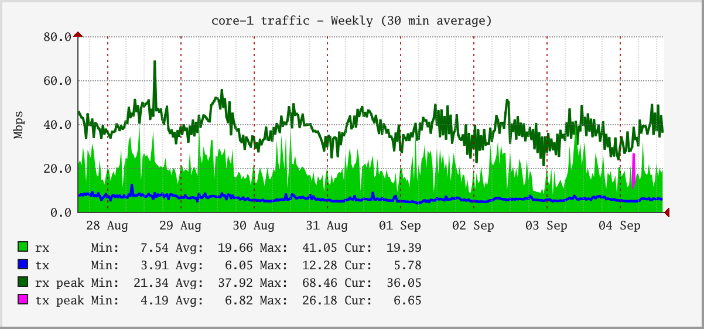
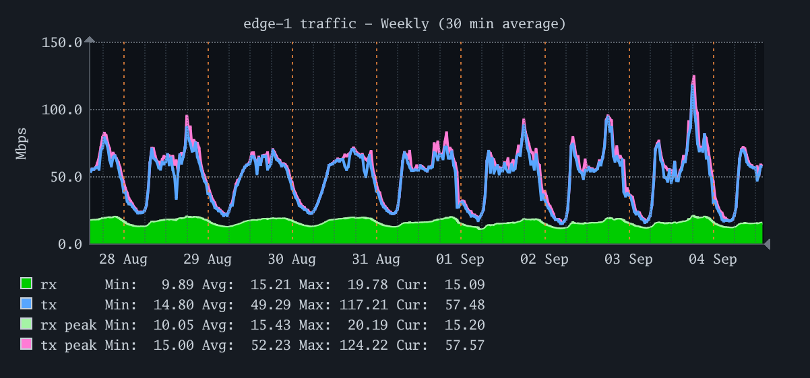
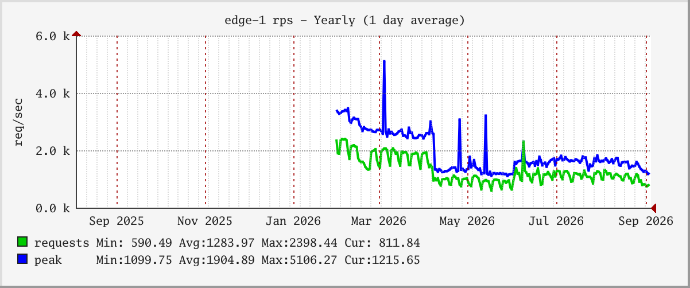

# prometheus-render

Draw RRDtool / MRTG / Munin style graphs straight from **Prometheus** or
**VictoriaMetrics**.

繁體中文說明見 [README.md](README.md)。

```
prometheus-render -q 'node_load1' --from -6h -o load.png
```



## Why this exists

There is no server-side image renderer in the Prometheus ecosystem. Both the
Prometheus UI and VictoriaMetrics' `vmui` draw with [uPlot], a browser canvas
library, so getting a PNG out of either means running a headless browser.

What makes the RRD look recognisable is specific: the Cur/Min/Avg/Max legend
table, the bevelled frame, a grey page around a white canvas, and gridlines
whose density follows how many seconds one pixel covers.

This repo carries [`tsgraph`](tsgraph/), a **pure-Go drawing library**. No
rrdtool process, no cairo, no cgo — `go build` cross-compiles it to any
platform as a single binary.

[uPlot]: https://github.com/leeoniya/uPlot

## Features

**The four MRTG timescales**, named after their averaging interval, with spans
that abut without a gap:

| File | Averaging | Span | MRTG calls it |
|---|---|---|---|
| `5m` | 5 minutes | 32 hours | Daily |
| `30m` | 30 minutes | 8 days | Weekly |
| `2h` | 2 hours | 5 weeks | Monthly |
| `1d` | 1 day | 13 months | Yearly |

**MRTG's four colour roles.** The peaks are the point of the scheme, because
averaging hides spikes:

| Colour | | Series |
|---|---|---|
| `#00CC00` | green | inbound, filled |
| `#0000FF` | blue | outbound, line |
| `#006600` | dark green | peak of the inbound |
| `#FF00FF` | magenta | peak of the outbound |

In the graph above the 30-minute average tops out at 41 Mbps, while the busiest
5-minute sample in the same window reached **68 Mbps** — the average understates
the real peak by two thirds.

**The dark theme** keeps MRTG's green and blue and lightens the two peak colours
instead: on a dark canvas a peak has to sit lighter than its own average to
separate from it, the opposite of darker-is-peak on white.



**Layering.** The grid and the labelled time rules are drawn *over* the data,
dashed and blended — an opaque line over a filled area cuts it into bands. A red
rule marks a tick that carries a label, so it never lands where there is nothing
to read.

**Real resolution.** `--zoom` redraws rather than upscales. The canvas, the
font, the line widths, the dash lengths and the grid thickness all scale
together; missing any one of them shows up as a washed-out colour rather than as
a thin line.

**A gap is a gap.** NaN breaks the line instead of being drawn as zero.



## Install

```sh
make build          # -> bin/prometheus-render
make install        # -> $GOPATH/bin
make test
```

Nothing else to install.

## Usage

```sh
prometheus-render -q <promql> [flags]
prometheus-render --serve :8080 [flags]
```

Run `prometheus-render -h` for the full list.

| Flag | Meaning |
|---|---|
| `-u, --url` | Data source base URL (env `PROMETHEUS_URL`), default `http://localhost:9090` |
| `-q, --query` | PromQL expression, repeatable |
| `-l, --legend` | Series name, with `{{label}}` placeholders, repeatable |
| `--from` / `--until` | Window: `-1h`, `-7d`, `now-90min`, a Unix timestamp, RFC3339 |
| `--step` | Resolution (`60`, `5min`). Default: about one point per pixel |
| `-t, --theme` | `mrtg`, `dark`, `munin` |
| `-w/-H` | Plot canvas size, default 400x175 |
| `--area` | `none`, `first`, `all`, `stacked` |
| `--zoom` | Redraw at a multiple of the nominal size |
| `--behind-from` | Draw series N onwards first, i.e. behind the rest |
| `--tz` | Timezone, e.g. `Asia/Taipei` |
| `-o, --output` | Output file, `-` for stdout |

### VictoriaMetrics

Point `--url` at the vmselect Prometheus-compatible prefix:

```sh
prometheus-render -u http://vmselect:8481/select/0/prometheus -q 'node_load1'
```

### Examples

The classic MRTG traffic graph — filled inbound, outbound as a line:

```sh
prometheus-render -t mrtg --area first --vtitle 'Mbps' \
  -q 'rate(node_network_receive_bytes_total{device="eth0"}[5m])*8/1000000'  -l 'rx' \
  -q 'rate(node_network_transmit_bytes_total{device="eth0"}[5m])*8/1000000' -l 'tx' \
  --title 'eth0' -o traffic.png
```

Munin-style stacked CPU:

```sh
prometheus-render -t munin --area stacked --from -1d --title CPU \
  -q 'sum by (mode) (rate(node_cpu_seconds_total[5m]))' -l '{{mode}}' -o cpu.png
```

### Scheduled graphs and an HTML site

`--config` takes a YAML file, draws every graph in it over MRTG's four
timescales, writes `index.html` and a page per graph, and redraws on the
interval the file names:

```bash
prometheus-render --config site.yml
```

```yaml
source:
  url: http://localhost:9090

output:
  dir: site
  title: Network
  listen: ":8080"   # empty writes the files and nothing more, for nginx
  interval: 5m      # 0 draws once and exits, which is what cron wants
  workers: 0        # 0 means one per CPU

defaults:
  theme: mrtg
  width: 500
  height: 150
  area: first
  tz: Asia/Taipei
  # Omit ranges to get MRTG's four: 1d / 1w / 1m / 1y

graphs:
  - name: traffic
    title: eth0 traffic
    vtitle: bits/sec
    series:
      - expr: rate(node_network_receive_bytes_total{device="eth0"}[5m]) * 8
        legend: inbound
      - expr: rate(node_network_transmit_bytes_total{device="eth0"}[5m]) * 8
        legend: outbound
```

One graph at one timescale is one job, and the jobs are independent, so they
run across `workers` goroutines rather than queueing on a single core.
`max_queries` separately bounds how many queries are in flight, so the fan-out
does not reach the source as one burst. A full example is in
[`site.example.yml`](site.example.yml).

Images are written through a temporary file and renamed into place, so anyone
reading the site mid-render never sees half an image.

### Server mode

`--serve` exposes a `/render` endpoint an `` tag can point at. The flags
above are accepted as URL parameters, with `target` in place of `--query`:

```html

```

`/healthz` returns `ok`.

## Using it as a library

`tsgraph` stands on its own and knows nothing about Prometheus — it takes
samples and returns a PNG:

```go
import "github.com/ExpTechTW/prometheus-render/tsgraph"

theme := tsgraph.LookupTheme("mrtg")
png, err := tsgraph.Render([]tsgraph.Series{{
    Name:   "rx",
    Start:  start.Unix(),
    Step:   300,
    Values: values,           // NaN marks a gap
    Colour: theme.Colour(0),
    Kind:   tsgraph.Area,
}}, tsgraph.Options{
    Title: "eth0", VLabel: "Mbps",
    Width: 500, Height: 150, Theme: theme,
})
```

Its only dependency is `golang.org/x/image`. The axis algorithms are described
in [`tsgraph/DESIGN.md`](tsgraph/DESIGN.md).

## Example images

Everything under `out/` is rendered from [`testdata/sample.db`](testdata/) —
offline, reproducible, and needing no data source:

```sh
make examples
```

The layout is `out/<metric>/<host>/<theme>/<variant>/<tier>.png`, where the
variant is `peak` (averages plus the peak traces) or `plain` (averages alone).

## Notes

- **Time ranges** accept the rrdtool spellings: `-1h`, `-90min`, `-7d`, `-2w`,
  `now-1d`, plus Unix timestamps and RFC3339.
- **Sample ceiling** is 11000 points per query, the Prometheus limit. Past that
  the step widens rather than the query failing.
- **Bucket convention**, as in RRD and MRTG: a sample taken at time T is drawn
  in the bucket *ending* at T.

## Layout

```
tsgraph/                the drawing library, usable on its own
cmd/prometheus-render   CLI
internal/promapi        query_range client, time parsing, densifying
internal/query          window and step resolution, parallel fetch
internal/params         settings shared by the CLI and the server
internal/render         joins a query to the library
internal/server         the /render endpoint
internal/config         the YAML config file
internal/site           scheduling, the worker pool and the HTML
examples/gallery        renders out/ from SQLite (its own module)
testdata/sample.db      the sample dataset
hack/                   checks that read the rendered pixels back
```

## License

Apache 2.0. See [`LICENSE`](LICENSE) and [`NOTICE`](NOTICE).
